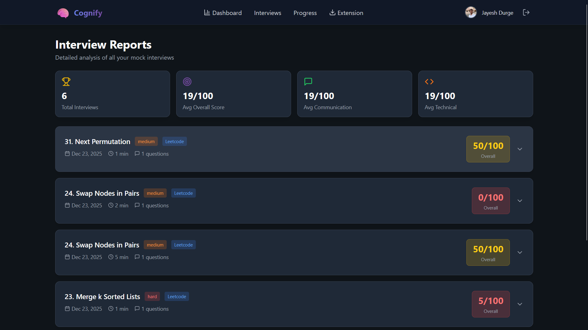
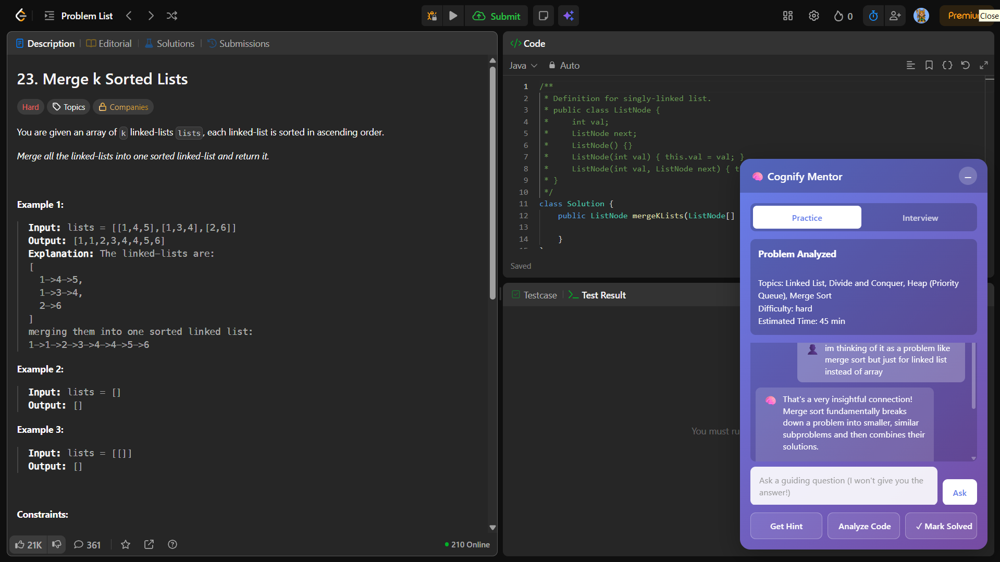

# 🧠 Cognify - AI-Powered Technical Interview Mentor

<div align="center">

### *Transforming Technical Interview Preparation with Google's AI*

[](https://reactjs.org/)
[](https://firebase.google.com/)
[](https://chrome.google.com/)
[](https://ai.google.dev/)

**🏆 Built for Google Developer Group Hackathon 2025**

*Teaching problem-solving skills through AI mentorship, not memorization* 🚀

[🚀 Quick Start](#-quick-start---5-minute-setup) | [📊 Live Dashboard](https://cognify-68642.web.app/) | [📥 Download Extension](#step-1-install-chrome-extension-2-minutes) | [🎯 Why This Matters](#-why-cognify-the-problem-were-solving)

</div>

---

## 🎯 For Hackathon Evaluators

**✅ Quick Testing:** The extension is ready to use! No compilation or build required.

| What You Need | Time Required | Where to Get It |
|--------------|---------------|-----------------|
| 🧩 Chrome Extension | 2 minutes | [Download & Load Unpacked](#step-1-install-chrome-extension-2-minutes) |
| 🔑 Free Gemini API Key | 1 minute | [Google AI Studio](https://aistudio.google.com/apikey) |
| 📊 Web Dashboard | 0 minutes | [Already Live!](https://cognify-68642.web.app/) |

**Total Setup Time: ~3 minutes** ⏱️

---

## 🌟 Google Technologies Powering Cognify

This project leverages **Google's cutting-edge cloud and AI ecosystem** to deliver a production-ready solution:

### 🤖 **Google Gemini 2.5 Flash AI** (Core Intelligence)
- **Real-time mentorship** through Socratic questioning
- **Smart hint generation** without spoiling solutions
- **Interview simulation** with natural conversation
- **Code analysis** and pattern recognition
- **Personalized learning recommendations**
- **400 tokens per call** for efficient, concise responses

### 🔥 **Firebase Platform** (Complete Backend)
- **Firebase Authentication** - Secure Google Sign-In across extension & web
- **Cloud Firestore** - Real-time NoSQL database for user progress
- **Firebase Hosting** - Blazing-fast global CDN for web dashboard
- **Firebase Security Rules** - Protecting user data and privacy

### 🌐 **Chrome Extensions Platform**
- **Manifest V3** - Latest extension architecture
- **Content Scripts** - Seamless integration with coding platforms
- **Side Panel API** - Non-intrusive AI assistant interface

### ☁️ **Google Cloud Infrastructure**
- Deployed on **Google Cloud Platform** via Firebase
- Global distribution through **Google's CDN**
- **99.9% uptime** with automatic scaling

---

## 🚀 Quick Start - 5 Minute Setup

### Step 1: Install Chrome Extension (2 minutes)

The extension is **fully built and ready to use**. No compilation needed!

1. **📥 Download the Extension**
   ```
   https://github.com/jayesh-durge/Cognify/archive/refs/heads/main.zip
   ```
   - Click the link above or download from the repository
   - Extract the ZIP file to a permanent location on your computer
   - ⚠️ **Important:** Don't delete this folder after installation!

2. **🔧 Load in Chrome Browser**
   - Open Chrome and navigate to: `chrome://extensions/`
   - Enable **"Developer mode"** (toggle switch in top-right corner)
   - Click **"Load unpacked"** button
   - Navigate to the extracted folder
   - Select the `Cognify-main/chrome-extension` folder
   - ✅ Extension will appear in your toolbar!

3. **🔑 Get Free Gemini API Key**
   - Visit: [Google AI Studio](https://aistudio.google.com/apikey)
   - Sign in with your Google account
   - Click **"Create API Key in new project"** or **"Get API key"**
   - Copy the generated API key (starts with "AIza...")
   - 💡 **100% Free** - No credit card required!

4. **⚙️ Configure Extension**
   - Click the Cognify extension icon in Chrome toolbar
   - Click the ⚙️ **Settings** gear icon
   - Paste your Gemini API key in the input field
   - Click **"Save API Key"**
   - Click **"Sign in with Google"** to authenticate

**🎉 Done! Your AI mentor is ready.**

---

### Step 2: Access Web Dashboard (0 minutes - Already Live!)

The dashboard is **hosted on Firebase** and ready to use:

🌐 **[Open Dashboard → cognify-68642.web.app](https://cognify-68642.web.app/)**

- ✅ No installation required
- ✅ Works on any device with a browser
- ✅ Sign in with the same Google account
- ✅ View your progress, analytics, and interview reports

---

### Step 3: Start Learning! (2 minutes)

1. **Visit a Coding Platform:**
   - 💻 [LeetCode](https://leetcode.com/problemset/)
   - 🏆 [CodeChef](https://www.codechef.com/problems/school)
   - 🎯 [Codeforces](https://codeforces.com/problemset)
   - 📚 [GeeksforGeeks](https://www.geeksforgeeks.org/explore)

2. **Open Any Problem** (try an easy one first!)

3. **Click the Cognify Icon** in your Chrome toolbar

4. **Choose Your Mode:**
   - **Practice Mode**: Get progressive hints while solving
   - **Interview Mode**: Simulate real technical interviews

5. **Start Solving!**
   - Ask questions to the AI mentor
   - Request hints when stuck
   - Get code analysis
   - Track your progress automatically

6. **View Analytics:**
   - Visit the [Dashboard](https://cognify-68642.web.app/)
   - See your solved problems, scores, and performance trends
   - Get personalized recommendations

---

## 💡 Why Cognify? The Problem We're Solving

### 📊 The Statistics Are Alarming

- **50M+** people prepare for technical interviews annually
- **$5B+** spent on interview prep courses globally
- **70%** of candidates fail technical interviews on first attempt
- **90%** of learning comes from passive consumption (watching, reading)
- **Only 10%** comes from active problem-solving

### 😓 Current Problems

1. **❌ Passive Learning Trap**
   - Students watch solutions on YouTube
   - Copy code from GeeksforGeeks
   - Don't develop actual problem-solving skills
   - Struggle when faced with new problems

2. **❌ No Personalized Guidance**
   - Generic hints don't address individual struggles
   - No real-time mentor available 24/7
   - Expensive to hire personal coaches ($100-300/hour)
   - Batch courses don't adapt to your pace

3. **❌ Fragmented Experience**
   - Practice on LeetCode
   - Track progress manually
   - Mock interviews on different platforms
   - No unified view of growth

4. **❌ Binary Feedback**
   - "Accepted" or "Wrong Answer"
   - No insights into your approach
   - Can't identify weak patterns
   - No actionable improvement suggestions

### ✅ How Cognify Solves These

1. **🎯 Active Learning Through Socratic Method**
   - AI asks guiding questions instead of giving answers
   - Progressive hints build problem-solving muscle
   - Learn to think, not memorize
   - **Result:** True skill development, not pattern matching

2. **🤖 24/7 Personal AI Mentor**
   - Instant help exactly when you're stuck
   - Adapts to your skill level
   - Costs $0 (powered by free Gemini API)
   - **Result:** Personalized guidance for everyone

3. **🌐 Unified Learning Ecosystem**
   - Single extension works across all platforms
   - One dashboard shows all progress
   - Seamless data sync via Firebase
   - **Result:** Complete visibility into your journey

4. **📊 Intelligent Analytics**
   - Track patterns in your struggles
   - Identify weak topics automatically
   - Get recommendations based on your data
   - **Result:** Data-driven improvement plans

---

## 🎨 How It Works - The User Experience

### 🧩 Chrome Extension (Your AI Companion)

**Lives in your browser, activates when you need it:**

#### Practice Mode 🎯
```
You: *Reading a LeetCode problem on Two Sum*
You: *Clicks Cognify icon*
AI: "I see you're working on Two Sum. Let's think through this together. 
     What data structure could help you track numbers you've seen?"
You: "Maybe an array?"
AI: "Good start! But think about lookup speed. What if you need to check 
     if you've seen a number before? What's faster than O(n) search?"
You: "Oh! A hash map!"
AI: "Excellent! Now, what would you store as key and value?"
```

**💡 Key Features:**
- ✅ Never gives direct solutions
- ✅ Asks questions that guide your thinking
- ✅ Adapts difficulty based on your responses
- ✅ Tracks time and hints used
- ✅ Non-intrusive side panel

#### Interview Mode 🎤
```
AI: "Let's conduct a technical interview. I'll be your interviewer.
     Tell me your initial approach to this problem."
You: *Explains approach verbally*
AI: "Interesting. What's the time complexity of your approach?"
You: "O(n²) with nested loops"
AI: "Can you think of a way to optimize it? What about space-time tradeoff?"
You: *Discusses optimization*
AI: "Good thinking! Now let's talk about edge cases..."

[After interview]
AI: "Here's your feedback:
     Communication: 85/100 - Clear explanation, good structure
     Technical: 70/100 - Correct but could optimize further
     Overall: 78/100 - Strong performance, interview-ready!"
```

**💡 Key Features:**
- ✅ Realistic interview simulation
- ✅ Natural conversation flow
- ✅ Evaluates communication + technical skills
- ✅ Detailed scoring with feedback
- ✅ Saves reports to dashboard

---

### 📊 Web Dashboard (Your Command Center)

**Cloud-hosted, accessible anywhere:**

#### What You See:
```
📈 Your Stats (This Week)
   🏆 8 Problems Solved (+4 from last week)
   ⭐ 50/100 Avg Interview Score  
   ⏱️ 6 Total Interviews

📊 Performance Trends
   [Interactive Chart showing improvement over time]
   
💪 Strong Topics: Arrays, Hash Tables, Two Pointers
⚠️ Needs Practice: Dynamic Programming, Graphs

📝 Recent Activity
   ✅ Completed Interview - "Merge k Sorted Lists" - Score: 5/100
   ✅ Solved "Next Permutation" - 1 hint used
   ✅ Completed Interview - "Swap Nodes in Pairs" - Score: 50/100

🎯 Recommended Next
   → Practice: "Longest Substring Without Repeating Characters"
   → Study: Dynamic Programming Patterns
```

**💡 Key Features:**
- ✅ Complete progress visualization
- ✅ Cross-platform problem tracking
- ✅ Interview performance analysis
- ✅ Personalized study recommendations
- ✅ Responsive design (works on phone/tablet)

---

## 🏗️ Architecture & Technical Implementation

### System Design

```
┌─────────────────────────────────────────────────────────────────┐
│                     COGNIFY ECOSYSTEM                           │
│              (Built Entirely on Google Technologies)            │
├─────────────────────────────────────────────────────────────────┤
│                                                                 │
│  ┌─────────────────────┐          ┌──────────────────────┐    │
│  │  Chrome Extension   │◄────────►│   Web Dashboard      │    │
│  │  (Manifest V3)      │  Auth    │   (React + Vite)     │    │
│  │                     │  Sync    │   Firebase Hosting   │    │
│  │  Content Scripts    │          │   TailwindCSS        │    │
│  │  Side Panel API     │          │   React Router       │    │
│  └─────────────────────┘          └──────────────────────┘    │
│           │                                  │                 │
│           └──────────────┬───────────────────┘                │
│                          │                                     │
│                  ┌───────▼────────┐                           │
│                  │  Firebase Cloud │                           │
│                  ├─────────────────┤                           │
│                  │ • Authentication│                           │
│                  │ • Cloud Firestore│                          │
│                  │ • Security Rules│                           │
│                  │ • Hosting       │                           │
│                  └────────┬────────┘                           │
│                           │                                    │
│                  ┌────────▼────────┐                          │
│                  │ Gemini 2.5 Flash│                          │
│                  ├─────────────────┤                          │
│                  │ • AI Mentorship │                          │
│                  │ • Hint Gen      │                          │
│                  │ • Interview Sim │                          │
│                  │ • Code Analysis │                          │
│                  │ • 400 token/call│                          │
│                  └─────────────────┘                          │
│                                                                │
└────────────────────────────────────────────────────────────────┘
```

### 🔧 Technology Stack

#### **Frontend**
- **React 18.2.0** - Modern component architecture
- **Vite 5.0** - Lightning-fast build tool
- **TailwindCSS 3.3** - Utility-first styling
- **React Router 6** - Client-side routing
- **Recharts 2.10** - Interactive data visualization
- **Lucide React** - Beautiful icon system

#### **Backend & Cloud (100% Google)**
- **Firebase Authentication** - Secure OAuth with Google Sign-In
- **Cloud Firestore** - Real-time NoSQL database
- **Firebase Hosting** - Global CDN deployment
- **Firebase Security Rules** - Data protection
- **Google Gemini 2.5 Flash** - AI intelligence engine

#### **Chrome Extension**
- **Manifest V3** - Latest Chrome extension standard
- **Content Scripts** - Platform integration (LeetCode, CodeChef, etc.)
- **Side Panel API** - Native Chrome UI component
- **Background Service Workers** - Event-driven architecture
- **Chrome Storage API** - Persistent local data

#### **Development Tools**
- **Git & GitHub** - Version control
- **Firebase CLI** - Deployment automation
- **ESLint** - Code quality
- **Chrome DevTools** - Debugging

---

## 🎯 Supported Platforms

Cognify seamlessly integrates with the most popular coding platforms:

#### 📊 Comprehensive Analytics
- Track progress across **all platforms in one dashboard**
- Visualize your **performance trends** over time
- Get **personalized recommendations** on what to study next
- Monitor **time spent** and **efficiency metrics**

#### ⏱️ Session Management
- Automatic **time tracking** for each problem
- **Session history** to review your journey

---

## 🎬 Use Cases

### 1️⃣ Interview Preparation (Primary Use Case)
**Scenario:** CS student preparing for tech interviews at Google, Microsoft, Amazon

**How Cognify Helps:**
- Practice on LeetCode with real-time AI hints
- Get feedback on approach before writing code
- Track weak topics and get targeted practice
- Dashboard shows readiness across topics

**Result:** Structured preparation with measurable progress

---

### 2️⃣ Competitive Programming Training
**Scenario:** Participating in CodeChef/Codeforces contests

**How Cognify Helps:**
- Analyze time spent per problem during practice
- Learn optimization techniques through guided hints
- Track contest performance trends
- Get recommendations for similar problems

**Result:** Improved problem-solving speed and accuracy

---

### 3️⃣ Learning from Video Tutorials
**Scenario:** Watching coding tutorials on YouTube

**How Cognify Helps:**
- AI assistant answers questions about video content
- Get code explanations in real-time
- Request practice problems related to the topic
- Track concepts learned from videos

**Result:** Active learning instead of passive watching

---

### 4️⃣ Self-Paced Skill Building
**Scenario:** Developer wanting to level up DSA skills

**How Cognify Helps:**
- Personalized learning paths based on current skill
- Daily recommendations keep learning consistent
- Progress tracking provides motivation
- AI mentor available 24/7 for guidance

**Result:** Continuous improvement with clear milestones

---

## 📦 Components

### 🧩 Chrome Extension (Local Installation)
Your AI mentor that lives in your browser and runs on your computer.

**What it does:**
- Provides AI hints while you solve problems
- Tracks your progress automatically
- Works on LeetCode, CodeChef, Codeforces, GeeksforGeeks, YouTube
- Side panel AI assistant
- Session timing and management

**Setup:** Download and install locally on your machine

💾 **[Download Extension](https://github.com/jayesh-durge/Cognify/archive/refs/heads/main.zip)** | 📖 **[Installation Guide →](chrome-extension/README.md)**

---

### 📊 Web Dashboard (Online - Already Hosted!)
Cloud-based analytics dashboard accessible from anywhere.

**What it does:**
- Visualizes your learning progress
- Shows performance analytics
- Provides interview reports
- Personalized recommendations
- Works on any device

**Setup:** None! Just visit the link and sign in

🌐 **[Open Dashboard →](https://cognify-68642.web.app/)** | 📖 **[Learn More →](web-dashboard/README.md)**

---

## �️ Setup (For Developers)

### Prerequisites
- Node.js (v16+)
- Google Chrome browser
- Firebase account
- Gemini API key (free)

### Installation

1. **Clone the repository:**
```bash
git clone https://github.com/jayesh-durge/Cognify.git
cd Cognify
```

2. **Set up Chrome Extension:**
```bash
cd chrome-extension
# Follow detailed instructions in chrome-extension/README.md
```
📖 **[Chrome Extension Setup Guide →](chrome-extension/README.md)**

3. **Set up Web Dashboard:**
```bash
cd web-dashboard
npm install
npm run dev
# Dashboard will run at http://localhost:5173
```
📖 **[Web Dashboard Setup Guide →](web-dashboard/README.md)**

4. **Configure Firebase:**
   - Create a [Firebase project](https://console.firebase.google.com/)
   - Enable Authentication (Google provider)
   - Set up Firestore Database
   - Add Firebase config to both components
   - See detailed guides in component READMEs

5. **Get Gemini API Key (Free):**
   - Visit [Google AI Studio](https://makersuite.google.com/app/apikey)
   - Create and copy your API key
   - Add to extension config

📚 **Detailed setup instructions available in component READMEs**

---

## 🎥 Screenshots

<div align="center">

### 📊 Main Dashboard


*Your personalized learning command center with progress tracking and analytics*

---

### 🎬 Welcome Page


*Onboarding experience introducing key features and quick setup*

---

### 📈 Progress Tracking


*Track all solved problems across platforms with difficulty filters*

---

### 🎤 Interview Reports


*Detailed interview analytics with scoring and performance metrics*

---

### 🎯 Demo Presentation


*Complete feature walkthrough and platform capabilities*

</div>

---

## 🏆 Hackathon Highlights

### Innovation
- **Novel Approach:** Socratic method applied to coding education
- **Seamless Integration:** Works within existing platforms, no context switching
- **AI-First Design:** Leverages Gemini AI for intelligent mentorship

### Technical Complexity
- Multi-platform content script injection
- Real-time AI integration with streaming responses
- Complex state management across extension and web app
- Firestore data modeling for scalable analytics

### Impact & Scalability
- **Addresses Real Problem:** 50M+ people prepare for tech interviews annually
- **Growing Market:** $5B+ spent on interview prep courses
- **Easy to Scale:** Cloud-first architecture ready for millions of users
- **Monetization Ready:** Freemium model with premium features

### User Experience
- **Zero Learning Curve:** Works on platforms students already use
- **Non-Intrusive:** Side panel doesn't disrupt coding flow
- **Beautiful UI:** Modern, responsive design with smooth animations
- **Accessible:** Works on any device with Chrome

---

## 📈 Future Roadmap

### Phase 1 (Current)
- ✅ Multi-platform support (LeetCode, CodeChef, Codeforces, GFG)
- ✅ AI hint system
- ✅ Progress tracking dashboard

### Phase 2 (Q1 2026)
- 🔄 System design interview practice
- 🔄 Peer comparison and leaderboards
- 🔄 Study groups and collaboration
- 🔄 Mobile app (iOS & Android)

### Phase 3 (Q2 2026)
- 📋 Company-specific preparation tracks
- 📋 Resume analysis and improvement
- 📋 Behavioral interview practice
- 📋 Job application tracking

### Phase 4 (Q3 2026)
- 📋 Marketplace for custom problem sets
- 📋 Mentor matching platform
- 📋 Corporate training partnerships
- 📋 API for third-party integrations

---

## 🤝 Contributing

We welcome contributions! Please see our contributing guidelines:

1. Fork the repository
2. Create a feature branch (`git checkout -b feature/AmazingFeature`)
3. Commit your changes (`git commit -m 'Add some AmazingFeature'`)
4. Push to the branch (`git push origin feature/AmazingFeature`)
5. Open a Pull Request

---

## 📄 License

This project is licensed under the MIT License - see the LICENSE file for details.

---

## 👥 Team

Built with ❤️ by passionate developers who understand the struggle of interview preparation.

**Project Maintainer:** [Jayesh Durge](https://github.com/jayesh-durge) <br>
**Project Maintainer:** [Ayush Sonekar](https://github.com/57ayush76) <br>
**Project Maintainer:** [Nihar Meshram](https://github.com/Nihar2426s)

---

## 🙏 Acknowledgments

- **Google Gemini AI** for providing the AI capabilities
- **Firebase** for reliable backend infrastructure
- **Open Source Community** for amazing tools and libraries
- **All the Interview Candidates** who inspired this solution

---

## 📞 Contact & Support

- **GitHub Issues:** [Report bugs or request features](https://github.com/jayesh-durge/Cognify/issues)
- **Email:** jayeshkishordurge@gmail.com
- **Dashboard:** [https://cognify-68642.web.app/](https://cognify-68642.web.app/)

---

<div align="center">

**Made for developers, by developers** 💻

**Star ⭐ this repo if you find it helpful!**

### Quick Links

🚀 [Download Extension](https://github.com/jayesh-durge/Cognify/archive/refs/heads/main.zip) | 📊 [Open Dashboard](https://cognify-68642.web.app/) | 📖 [Extension Guide](chrome-extension/README.md) | 📈 [Dashboard Docs](web-dashboard/README.md) | 🐛 [Report Bug](https://github.com/jayesh-durge/Cognify/issues)

</div>
